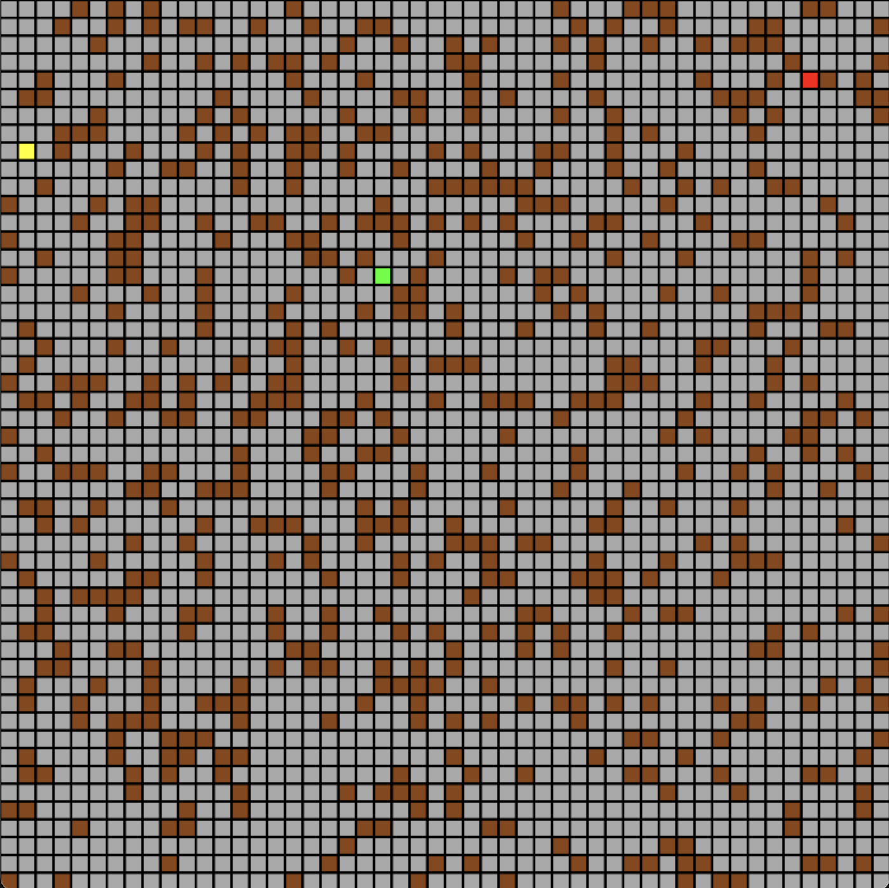

# Maze AI Project

This repository contains a grid-based maze navigation system built with Pygame, where an agent navigates through a maze toward a goal using the A* search algorithm and the Q-learning Reinforcement Learning algorithm. The project also includes keyboard control functionality and an `execute` function to step the agent forward.

# Sample Image of the Agent and Goblin Traversing a Maze

Yellow Square: Agent
Green Square: Goblin
Brown Square: Wall
Gray Square: Floor
Red Square: Exit


## Game Objective

Navigate the agent(in yellow) from the left side of the maze to the red exit on the right side while avoiding the green agent.

## Features

* **Pygame-based visualization** of a maze grid.
* **Agent navigation** through free cells while avoiding obstacles.
* **A* search implementation** using Manhattan distance as the heuristic.
* **Supports both autonomous navigation and manual control**.
* **Step-by-step execution** of agent moves via the provided `execute` function.

## File Overview

* `game.py` – Initializes the game window, draws the grid, updates frames, and handles input.
* `agent.py` – Defines the A* implementation for the agent's movement.
* `goblin.py` – Defines the A* implementation for the goblin's movement.
* `q_learning_gridgame.py` – Defines the Q-Learning implementation for the agent and goblin's movement.
* `double_q_driver.py` - Driver that runs our Q-learning implementation for both the agent and the goblin's movement. Generates one or many mazes for training (depending on flags specified at execution). If only a single maze is requested, its data will be saved for evaluation.
* `single_q_driver.py` - Driver that runs our Q-Learning implementation for the agent's movement, but the goblin's movement is determined by A*. Generates one or many mazes for training (depending on flags specified at execution). If only a single maze is requested, its data will be saved for evaluation.

## How It Works

### A* Search

The agent uses A* to plan a path from its current position to the goal located at the **right side of the grid**. The algorithm:

* Uses **Manhattan distance** as the heuristic.
* Avoids obstacles when expanding neighbors.
* Returns a sequence of grid positions representing the shortest path.
* The agent selects the **next step** from this path and returns it via `plan_next_move()`.

### Q-learning  
Depending on which "q-learning driver" is executed, the agent and/or goblin use Q-learning (Reinforcement Learning) to steadily make observations about their environment and determine the results of each action they take.

Rewards for the agent are determined by:
* Proximity to goblin.
* Whether or not the agent has reached a terminal state.
* Length of the shortest path from the agent's position to the exit.
* Whether or not the agent is taking the optimal path to the exit.

Rewards for the goblin are determined by:
* Proximity to the agent/player.
* Whether or not the goblin has reached a terminal state.

## Running the Project

### Requirements

```
Python 3.x
pygame
numpy
```

Install dependencies:

```
pip install pygame
pip install numpy
```

Run the game (read comments at the top of the "q_learning drivers" for information about what each flag does):

```
python (or python3) game.py
python (or python3) single_q_driver.py <train> <not_train> <single> <gui>
python (or python3) double_q_driver.py <train> <not_train> <single> <gui>
```

A window will appear showing the maze, agent, and goal if game.py is executed. This window will only appear for the "q-learning drivers" if the gui flag is given as a command line argument.

## Project Structure

```
├── game.py
├── agent.py
├── goblin.py
├── q_learning_gridgame.py
├── double_q_driver.py
├── single_q_driver.py
└── README.md
```


